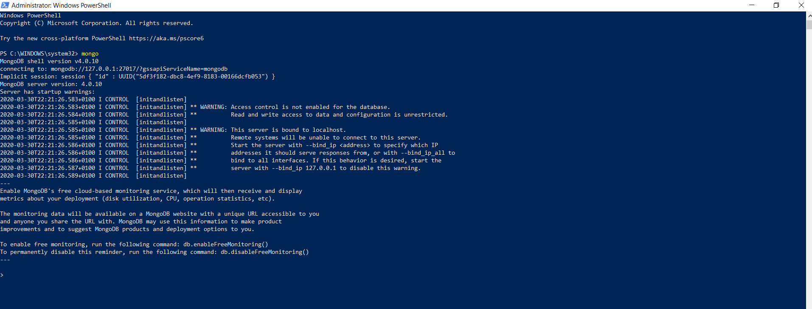

# Mongodb Basics

This image below is that of the executable files [mongod and mongo]

This is the connection image for the mongod server.

This is the connection image to the mongo db

Here, the database has been created

Here, the interns collection has been created

