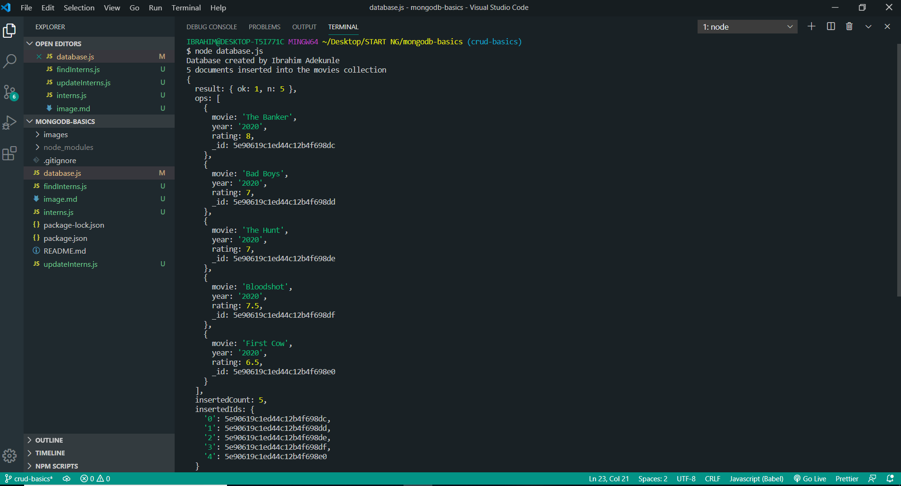
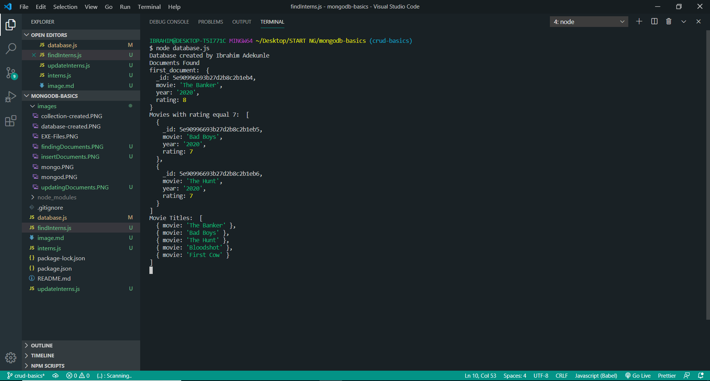
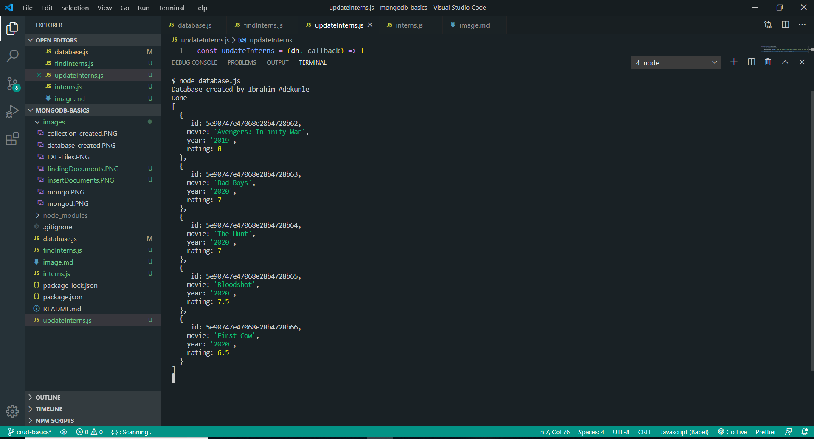

# *Node JS - Task 3: Simple MongoDB CRUD Operations*

This is the image displaying when the documents were inserted to the *myMovies* collection.

The second image shows where the function to find specific documents was executed

The third image shows where the update method was implemented

